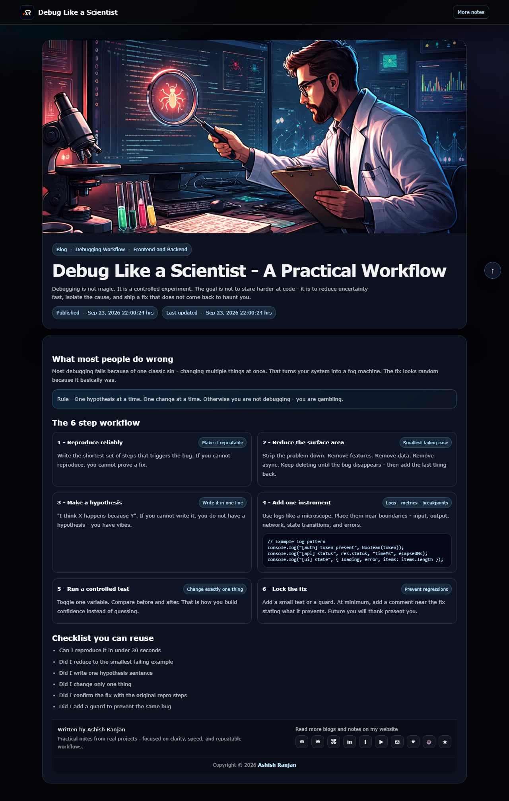

# Debug Like a Scientist

A practical static blog article about debugging with scientific thinking: reproduce the issue, reduce the failing surface, test one hypothesis, and prevent regressions.

## Features

- Six-step debugging workflow
- Practical checklists, callouts, and logging examples
- Responsive reading layout with fixed branded header
- Local assets, social sharing metadata, and go-to-top control

## Tech stack

HTML, CSS, and JavaScript.

## Run locally

Open index.html in a browser or use any local static server. Run npm install and npm run deploy to publish it to GitHub Pages.

## Links

- Portfolio: [https://www.ashishranjan.net](https://www.ashishranjan.net)
- GitHub: [https://github.com/a2rp](https://github.com/a2rp)
- CodePen: [https://codepen.io/ash1198](https://codepen.io/ash1198)
- LinkedIn: [https://www.linkedin.com/in/aashishranjan](https://www.linkedin.com/in/aashishranjan)
- Facebook: [https://www.facebook.com/theash.ashish/](https://www.facebook.com/theash.ashish/)
- YouTube: [https://www.youtube.com/@ashishranjan-ashz?sub_confirmation=1](https://www.youtube.com/@ashishranjan-ashz?sub_confirmation=1)
- Email: [ash.ranjan09@gmail.com](mailto:ash.ranjan09@gmail.com)

## Support

- Support: [https://a2rp-donation-page.netlify.app/](https://a2rp-donation-page.netlify.app/)
- Buy Me a Coffee: [https://buymeacoffee.com/a2rp](https://buymeacoffee.com/a2rp)
- Patreon: [https://patreon.com/a2rp](https://patreon.com/a2rp)
